# GrpcClient - Modern gRPC Client with Web UI

A comprehensive gRPC client solution built with Rust and React, providing both command-line and web-based interfaces for testing, debugging, and exploring gRPC APIs.


## 🚀 Overview

GrpcClient is a modern, full-featured gRPC client that combines the power of Rust's type safety and performance with an intuitive React-based web interface. It supports all gRPC streaming types, provides schema-based form generation, and offers a clean, opinionated design focused on developer productivity.

### Key Features

- **🌐 Modern Web UI**: React + TypeScript interface with real-time interactions
- **📡 Full Streaming Support**: Unary, Server Streaming, Client Streaming, and Bidirectional Streaming
- **🔍 Service Discovery**: Automatic gRPC reflection with service/method exploration
- **📋 Schema-Based Forms**: Dynamic form generation from protobuf schemas
- **📚 Call History**: Complete request/response tracking with expandable panels
- **🔐 Security**: TLS support with custom certificates and headers
- **⚡ Performance**: Built with Rust for optimal performance and memory safety

## 🛠️ Installation

### Prerequisites

- **Rust**: 1.80 or later
- **Node.js**: 20+ (for web UI)
- **gRPC Server**: Any gRPC server with reflection enabled

### Build from Source

```bash
# Clone the repository
git clone https://github.com/tyrchen/grpc-client.git
cd grpc-client

# Build the Rust backend
cargo build --release

# Build the web UI
cd ui
npm install
npm run build
```

## 🎯 Usage Guide

### Web Interface

1. **Start the Application**

   ```bash
   # Terminal 1: Start the Rust backend
   cargo run --bin server

   # Terminal 2: Start the web UI
   cd ui && npm run dev
   ```

2. **Access the Interface**: Open <http://localhost:4000>

3. **Connect to gRPC Server**:
   - Add your gRPC server endpoint (e.g., `localhost:9090`)
   - Services and methods will be auto-discovered via reflection

4. **Make gRPC Calls**:
   - Select service and method from the left sidebar
   - Fill in the schema-based form or use JSON mode
   - Add custom headers if needed
   - Click "Call Method" to execute

### Command Line Interface


```bash
# List all services
grpc-client list localhost:9090

# List methods for a specific service
grpc-client list localhost:9090 myservice.UserService

# Describe a service or method
grpc-client describe localhost:9090 myservice.UserService
grpc-client describe localhost:9090 myservice.UserService.GetUser

# Call a method with JSON data
grpc-client call localhost:9090 myservice.UserService.GetUser \
  -d '{"user_id": "123"}'

# Call with data from file
grpc-client call localhost:9090 myservice.UserService.CreateUser \
  -d @user-data.json

# Call with custom headers
grpc-client call localhost:9090 myservice.UserService.GetUser \
  -H "Authorization: Bearer token123" \
  -d '{"user_id": "123"}'

# Use plaintext connection (no TLS)
grpc-client --plaintext list localhost:8080
```

## 🔧 Advanced Features

### Client Streaming Support


For methods that support client streaming (e.g., bidirectional streaming), the web UI automatically provides:

- **Multiple Request Interface**: Add/remove multiple requests with + button
- **Individual Forms**: Each request gets its own schema-based form
- **Array JSON Output**: Requests are combined into JSON array format
- **Real-time Sync**: Form and JSON modes stay synchronized

Example for `GetUser` bidirectional streaming:

```json
[
  {"user_id": "1"},
  {"user_id": "2"},
  {"user_id": "3"}
]
```

### Schema-Based Form Generation

The web UI dynamically generates forms based on protobuf schemas:

- **All Data Types**: String, number, boolean, arrays, objects, enums
- **Nested Structures**: Full support for complex nested messages
- **Enum Support**: Dropdown selects for enum values
- **Required Fields**: Visual indicators with red asterisks
- **Default Values**: Optional emission of default values

### Headers Management

Add custom headers with the key-value interface:


- **Metadata Headers**: Standard gRPC metadata
- **Authentication**: Bearer tokens, API keys
- **Custom Headers**: Any key-value pairs
- **Multiple Headers**: Add unlimited header rows

### Call History

Comprehensive request/response tracking:

- **Auto-Expand**: Latest requests automatically expand
- **Copy Functionality**: Copy requests, responses, or headers
- **Search**: Filter history by service, method, or server
- **Success/Error Indicators**: Clear visual status indicators
- **Duration Tracking**: Performance monitoring for each call

## 🏗️ Architecture & Development

### Development Methodology

This project demonstrates a modern AI-assisted development approach using advanced project management techniques:

#### 1. **Code Analysis & Requirements**

- **Studied grpcurl**: Analyzed the original Go implementation to understand core requirements
- **Generated PRD**: Created comprehensive [Product Requirements Document](./specs/product-requirements.md)
- **Rust Design**: Developed detailed [Rust Design Document](./specs/rust-design.md)

#### 2. **Memory Bank Management**

- **Structured Planning**: Used isolation rules and complexity-based workflows
- **Phase-Based Development**: Creative → Plan → Build → Reflect cycles
- **Progressive Documentation**: Maintained living documentation throughout development

#### 3. **Implementation Strategy**

- **Backend First**: Rust gRPC client with reflection support
- **API Layer**: RESTful interface for web UI integration
- **Frontend Development**: Modern React with TypeScript and Tailwind CSS
- **Full Integration**: End-to-end streaming and schema support

### Technical Stack

**Backend (Rust)**:

- `tonic` - gRPC implementation
- `tonic-reflection` - Server reflection support
- `tokio` - Async runtime
- `axum` - Web framework for API
- `serde` - Serialization

**Frontend (React + TypeScript)**:

- `React 18` - UI framework
- `TypeScript` - Type safety
- `Tailwind CSS` - Styling
- `shadcn/ui` - Component library
- `Zustand` - State management
- `Vite` - Build tool

**Architecture**:

```mermaid
graph TB
    subgraph "Client Layer"
        Browser["🌐 Web Browser"]
        CLI["💻 CLI Interface"]
    end

    subgraph "Frontend (React + TypeScript)"
        UI["🎨 React UI"]
        Store["📦 Zustand Store"]
        Components["🧩 UI Components"]

        UI --> Store
        UI --> Components
        Store --> Components
    end

    subgraph "Backend (Rust)"
        API["🔌 Axum API Server"]
        GrpcClient["🚀 gRPC Client"]
        Reflection["🔍 Reflection Service"]
        Connection["🔗 Connection Manager"]

        API --> GrpcClient
        GrpcClient --> Reflection
        GrpcClient --> Connection
    end

    subgraph "Target Services"
        GrpcServer1["🎯 gRPC Server 1"]
        GrpcServer2["🎯 gRPC Server 2"]
        GrpcServerN["🎯 gRPC Server N"]
    end

    %% Client connections
    Browser --> UI
    CLI --> GrpcClient


    %% Backend to Services
    Connection --> GrpcServer1
    Connection --> GrpcServer2
    Connection --> GrpcServerN

    %% Data Flow Labels
    UI -->|"HTTP/REST API"| API
    GrpcClient -.->|"Server Reflection"| Reflection
    Reflection -.->|"Schema Discovery"| GrpcServer1

    %% Styling
    classDef frontend fill:#e1f5fe,stroke:#01579b,color:#000
    classDef backend fill:#f3e5f5,stroke:#4a148c,color:#000
    classDef services fill:#e8f5e8,stroke:#1b5e20,color:#000
    classDef client fill:#fff3e0,stroke:#e65100,color:#000

    class UI,Store,Components frontend
    class API,GrpcClient,Reflection,Connection backend
    class GrpcServer1,GrpcServer2,GrpcServerN services
    class Browser,CLI client
```



### Memory Bank Approach

The project leverages an advanced Memory Bank system for AI-assisted development:

```mermaid
graph LR
    subgraph "Memory Bank Development Methodology"
        VAN["🎯 VAN Mode<br/>Validation & Entry Point"]
        Creative["🎨 Creative Mode<br/>Design Decisions"]
        Plan["📋 Plan Mode<br/>Implementation Planning"]
        Build["🏗️ Build Mode<br/>Code Implementation"]
        Reflect["🔍 Reflect Mode<br/>Review & Documentation"]

        VAN --> Creative
        Creative --> Plan
        Plan --> Build
        Build --> Reflect
        Reflect -.->|"Iteration"| Creative
    end

    subgraph "Development Phases"
        Phase1["📚 Code Analysis<br/>grpcurl study"]
        Phase2["📋 Requirements<br/>PRD & Design docs"]
        Phase3["🏗️ Implementation<br/>Backend → Frontend"]
        Phase4["🎨 UI Development<br/>React + Streaming"]
        Phase5["📖 Documentation<br/>README & Guides"]

        Phase1 --> Phase2
        Phase2 --> Phase3
        Phase3 --> Phase4
        Phase4 --> Phase5
    end

    VAN -.->|"Maps to"| Phase1
    Creative -.->|"Maps to"| Phase2
    Plan -.->|"Maps to"| Phase3
    Build -.->|"Maps to"| Phase4
    Reflect -.->|"Maps to"| Phase5

    classDef vanStyle fill:#fff3e0,stroke:#e65100,color:#000
    classDef creativeStyle fill:#f3e5f5,stroke:#4a148c,color:#000
    classDef planStyle fill:#e1f5fe,stroke:#01579b,color:#000
    classDef buildStyle fill:#e8f5e8,stroke:#1b5e20,color:#000
    classDef reflectStyle fill:#fce4ec,stroke:#880e4f,color:#000

    class VAN vanStyle
    class Creative creativeStyle
    class Plan planStyle
    class Build buildStyle
    class Reflect reflectStyle
```



This methodology ensures:

- **Consistent Quality**: Structured development phases
- **Complete Documentation**: Living docs that evolve with code
- **Risk Management**: Early validation and planning
- **Maintainable Code**: Clean architecture and patterns

## 🔬 Technical Details

### Streaming Implementation

```rust
// Backend streaming support
pub enum StreamingType {
    Unary,
    ServerStream,
    ClientStream,
    BiDirectional,
}

// Frontend automatically detects streaming types
const isClientStreaming = selectedMethod?.clientStreaming ||
    methodSchema?.streaming_type?.includes('BiDirectional');
```

### Schema Processing

```typescript
// Dynamic form generation from protobuf schemas
interface MethodSchema {
  inputType: string;
  outputType: string;
  streamingType: string;
  schema: {
    type: string;
    properties: Record<string, SchemaProperty>;
    required: string[];
  };
}
```

### Performance Optimizations

- **Bundle Size**: 311KB optimized production build
- **Type Safety**: Full TypeScript coverage with strict mode
- **Memory Efficiency**: Rust backend with zero-copy optimizations
- **Real-time Updates**: Efficient state management with Zustand

## 🧪 Testing & Examples

### Example gRPC Service

```protobuf
service UserService {
  rpc GetUser(GetUserRequest) returns (User);
  rpc CreateUser(CreateUserRequest) returns (User);
  rpc ListUsers(ListUsersRequest) returns (stream User);
  rpc StreamUsers(stream GetUserRequest) returns (stream User); // Bidirectional
}

message GetUserRequest {
  string user_id = 1;
}

message User {
  string id = 1;
  string name = 2;
  string email = 3;
  repeated Address addresses = 4;
  repeated PhoneNumber phone_numbers = 5;
}
```

### Testing Scenarios

1. **Unary RPC**: Simple request/response
2. **Server Streaming**: Multiple responses from single request
3. **Client Streaming**: Multiple requests to single response
4. **Bidirectional**: Full duplex communication
5. **Complex Schemas**: Nested objects, arrays, enums
6. **Error Handling**: Various gRPC status codes

## 📊 Performance Metrics

- **Startup Time**: < 500ms for web UI
- **Request Latency**: ~10ms overhead for simple calls
- **Memory Usage**: ~50MB for web UI, ~10MB for backend
- **Bundle Size**: 311KB gzipped production build
- **TypeScript**: 100% type coverage, zero errors

## 🤝 Contributing

We welcome contributions! Please see our [Contributing Guide](./CONTRIBUTING.md) for details.

### Development Setup

```bash
# Setup development environment
git clone https://github.com/tyrchen/grpc-client.git
cd grpc-client

# Backend development
cargo run --bin server

# Frontend development
cd ui
npm install
npm run dev

# Run tests
cargo test
cd ui && npm test
```

## 📈 Roadmap

- [ ] **Authentication**: OAuth2, JWT token management
- [ ] **Plugins**: Extensible plugin system
- [ ] **Import/Export**: Request collections and environments
- [ ] **Monitoring**: Performance metrics and health checks
- [ ] **CLI Improvements**: Enhanced command-line interface
- [ ] **Documentation**: Interactive API documentation generation

## 📝 License

This project is distributed under the terms of MIT License.

See [LICENSE](LICENSE.md) for details.

Copyright 2025 Tyr Chen

---

**Built with ❤️ using Vibe Coding**
