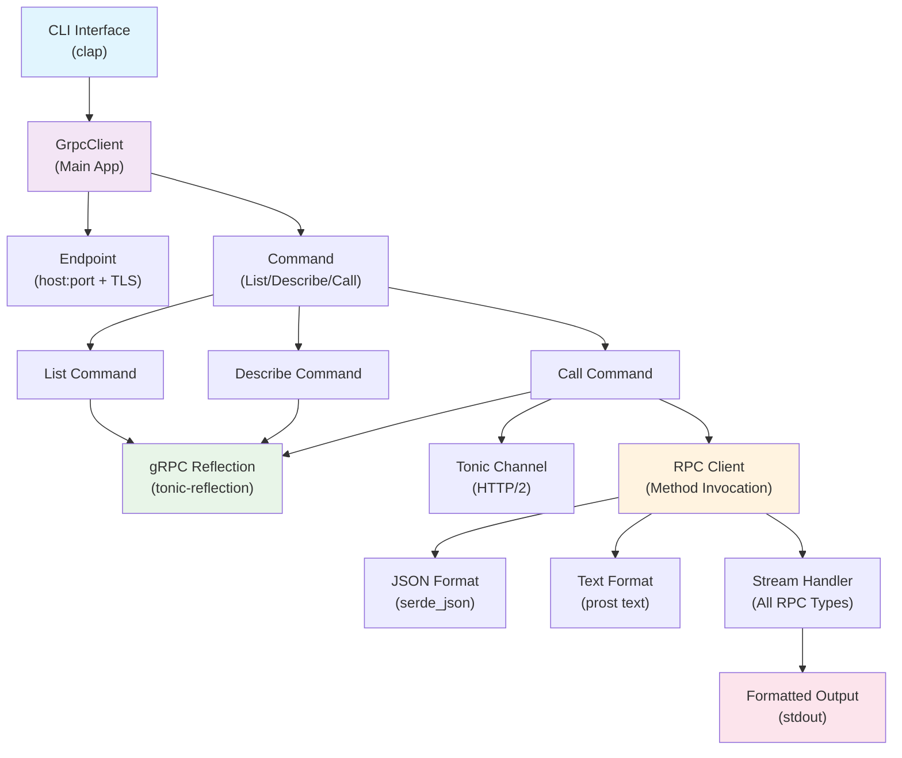

# GrpcClient Rust Design Document

> **Version:** 1.0
> **Date:** 2024
> **Target:** GrpcClient - Modern gRPC CLI tool in Rust

## Architecture Overview

This document outlines the design for GrpcClient, a clean and opinionated gRPC command-line tool implemented in Rust. Rather than trying to replicate every feature of the original grpcurl, this design focuses on the most common use cases with a streamlined, maintainable architecture.

## Design Principles

- **Simplicity Over Flexibility**: Clean, opinionated design for common use cases
- **Type Safety**: Leverage Rust's type system to prevent runtime errors
- **Performance**: Zero-cost abstractions and efficient async I/O
- **Maintainability**: Clear code structure with minimal complexity
- **Secure by Default**: TLS enabled by default, secure configuration

## Technology Stack

### Core Dependencies

```toml
[dependencies]
# CLI Framework
clap = { version = "4.4", features = ["derive", "env"] }

# gRPC & Protobuf
tonic = "0.13"
tonic-reflection = "0.13"
prost = "0.13"
prost-types = "0.13"

# Async Runtime
tokio = { version = "1.45", features = ["full"] }
tokio-stream = "0.1"

# Serialization
serde = { version = "1.0", features = ["derive"] }
serde_json = "1.0"

# Error Handling
anyhow = "1.0"

# Utilities
derive_more = "2"
```

## Core Type System Design

### Simple Domain Types

```rust
use derive_more::{Display, From, Into};
use serde::{Deserialize, Serialize};

// Simple newtypes for domain concepts
#[derive(Debug, Clone, PartialEq, Eq, Display, From, Into)]
pub struct ServiceName(String);

#[derive(Debug, Clone, PartialEq, Eq, Display, From, Into)]
pub struct MethodName(String);

// Clean endpoint representation
#[derive(Debug, Clone)]
pub struct Endpoint {
    pub host: String,
    pub port: u16,
    pub tls: bool,
}

impl Endpoint {
    pub fn parse(address: &str) -> anyhow::Result<Self> {
        // Simple parsing logic for host:port with optional scheme
        if address.starts_with("https://") || address.starts_with("grpcs://") {
            let addr = address.split("://").nth(1).unwrap_or(address);
            Self::parse_host_port(addr, true)
        } else if address.starts_with("http://") || address.starts_with("grpc://") {
            let addr = address.split("://").nth(1).unwrap_or(address);
            Self::parse_host_port(addr, false)
        } else {
            // Default to TLS for security
            Self::parse_host_port(address, true)
        }
    }

    fn parse_host_port(address: &str, tls: bool) -> anyhow::Result<Self> {
        let parts: Vec<&str> = address.rsplitn(2, ':').collect();
        match parts.len() {
            2 => Ok(Self {
                host: parts[1].to_string(),
                port: parts[0].parse()?,
                tls,
            }),
            1 => Ok(Self {
                host: parts[0].to_string(),
                port: if tls { 443 } else { 80 },
                tls,
            }),
            _ => Err(anyhow::anyhow!("Invalid endpoint format")),
        }
    }
}

// Configuration types
#[derive(Debug, Clone)]
pub enum OutputFormat {
    Json { pretty: bool, emit_defaults: bool },
    Text { compact: bool },
}

impl Default for OutputFormat {
    fn default() -> Self {
        Self::Json { pretty: true, emit_defaults: false }
    }
}
```

### Simple Schema Source

```rust
// Simple enum for schema sources - no complex type states
#[derive(Debug)]
pub enum SchemaSource {
    Reflection(ReflectionSource),
    // Future: could add file-based sources if needed
}

impl SchemaSource {
    pub async fn from_reflection(endpoint: &Endpoint) -> Result<Self, SchemaError> {
        let source = ReflectionSource::new(endpoint).await?;
        Ok(Self::Reflection(source))
    }
}

#[async_trait::async_trait]
impl DescriptorSource for SchemaSource {
    async fn list_services(&self) -> Result<Vec<ServiceName>, SchemaError> {
        match self {
            Self::Reflection(source) => source.list_services().await,
        }
    }

    async fn find_symbol(&self, name: &str) -> Result<Symbol, SchemaError> {
        match self {
            Self::Reflection(source) => source.find_symbol(name).await,
        }
    }

    async fn get_method_descriptor(&self, service: &str, method: &str) -> Result<MethodDescriptor, SchemaError> {
        match self {
            Self::Reflection(source) => source.get_method_descriptor(service, method).await,
        }
    }
}
```

### Clean CLI Interface

```rust
use clap::{Parser, Subcommand};

#[derive(Parser)]
#[command(name = "grpc-client")]
#[command(about = "A modern gRPC command-line client")]
pub struct Cli {
    #[command(subcommand)]
    pub command: Command,

    /// Skip TLS (use plain HTTP/2)
    #[arg(long)]
    pub plaintext: bool,

    /// Additional headers in 'name: value' format
    #[arg(short = 'H', long)]
    pub header: Vec<String>,

    /// Output format
    #[arg(long, default_value = "json")]
    pub format: FormatType,

    /// Verbose output
    #[arg(short, long)]
    pub verbose: bool,
}

#[derive(Subcommand)]
pub enum Command {
    /// List services or methods
    List {
        /// Server endpoint (host:port)
        endpoint: String,
        /// Optional service name to list methods for
        service: Option<String>,
    },
    /// Describe a service, method, or message
    Describe {
        /// Server endpoint (host:port)
        endpoint: String,
        /// Symbol to describe
        symbol: String,
    },
    /// Invoke a gRPC method
    Call {
        /// Server endpoint (host:port)
        endpoint: String,
        /// Method to call (service.method or service/method)
        method: String,
        /// Request data (JSON string or @filename or @- for stdin)
        #[arg(short, long)]
        data: Option<String>,
        /// Emit default values in JSON output
        #[arg(long)]
        emit_defaults: bool,
    },
}

#[derive(clap::ValueEnum, Clone, Debug)]
pub enum FormatType {
    Json,
    Text,
}
```

## Core Trait Definitions

### Descriptor Source Trait

```rust
#[async_trait::async_trait]
pub trait DescriptorSource: Send + Sync {
    /// List all available services
    async fn list_services(&self) -> Result<Vec<ServiceName>, SchemaError>;

    /// List methods for a specific service
    async fn list_methods(&self, service: &ServiceName) -> Result<Vec<MethodName>, SchemaError>;

    /// Find a symbol by fully qualified name
    async fn find_symbol(&self, name: &str) -> Result<Symbol, SchemaError>;

    /// Get all file descriptors
    async fn get_all_files(&self) -> Result<Vec<FileDescriptor>, SchemaError>;

    /// Find extensions for a message type
    async fn find_extensions(&self, message_type: &MessageType) -> Result<Vec<Extension>, SchemaError>;
}

// Symbol types for introspection
#[derive(Debug, Clone)]
pub enum Symbol {
    Service(ServiceDescriptor),
    Method(MethodDescriptor),
    Message(MessageDescriptor),
    Enum(EnumDescriptor),
    Field(FieldDescriptor),
}

#[derive(Debug, Clone)]
pub struct ServiceDescriptor {
    pub name: ServiceName,
    pub methods: Vec<MethodDescriptor>,
    pub description: Option<String>,
}

#[derive(Debug, Clone)]
pub struct MethodDescriptor {
    pub name: MethodName,
    pub service: ServiceName,
    pub input_type: MessageType,
    pub output_type: MessageType,
    pub client_streaming: bool,
    pub server_streaming: bool,
    pub description: Option<String>,
}
```

### Request/Response Processing

```rust
#[async_trait::async_trait]
pub trait RequestParser: Send + Sync {
    /// Parse the next request message
    async fn next_request(&mut self) -> Result<Option<prost_types::Any>, ParseError>;

    /// Get the number of requests parsed so far
    fn request_count(&self) -> usize;
}

#[async_trait::async_trait]
pub trait ResponseFormatter: Send + Sync {
    /// Format a response message for output
    async fn format_response(&self, response: &prost_types::Any) -> Result<String, FormatError>;

    /// Format an error status
    async fn format_error(&self, status: &tonic::Status) -> Result<String, FormatError>;
}

// JSON formatter implementation
pub struct JsonFormatter {
    emit_defaults: bool,
    resolver: Box<dyn MessageResolver>,
}

impl JsonFormatter {
    pub fn new(emit_defaults: bool, resolver: Box<dyn MessageResolver>) -> Self {
        Self {
            emit_defaults,
            resolver,
        }
    }
}

#[async_trait::async_trait]
impl ResponseFormatter for JsonFormatter {
    async fn format_response(&self, response: &prost_types::Any) -> Result<String, FormatError> {
        let message = self.resolver.resolve_any(response).await?;
        let json_value = message_to_json(&message, self.emit_defaults)?;
        Ok(serde_json::to_string_pretty(&json_value)?)
    }

    async fn format_error(&self, status: &tonic::Status) -> Result<String, FormatError> {
        let error_info = ErrorInfo {
            code: status.code() as i32,
            message: status.message().to_string(),
            details: status.details().to_vec(),
        };
        Ok(serde_json::to_string_pretty(&error_info)?)
    }
}
```

### Connection Management

```rust
// Connection builder with type-state pattern
pub struct ConnectionBuilder<HasEndpoint, HasSecurity> {
    endpoint: Option<Endpoint>,
    security: Option<SecurityConfig>,
    timeout: Option<Duration>,
    keepalive: Option<Duration>,
    max_message_size: Option<usize>,
    user_agent: Option<String>,
    _marker: PhantomData<(HasEndpoint, HasSecurity)>,
}

pub struct Missing;
pub struct Present;

impl ConnectionBuilder<Missing, Missing> {
    pub fn new() -> Self {
        Self {
            endpoint: None,
            security: None,
            timeout: None,
            keepalive: None,
            max_message_size: None,
            user_agent: None,
            _marker: PhantomData,
        }
    }
}

impl<HasSecurity> ConnectionBuilder<Missing, HasSecurity> {
    pub fn endpoint(self, endpoint: Endpoint) -> ConnectionBuilder<Present, HasSecurity> {
        ConnectionBuilder {
            endpoint: Some(endpoint),
            security: self.security,
            timeout: self.timeout,
            keepalive: self.keepalive,
            max_message_size: self.max_message_size,
            user_agent: self.user_agent,
            _marker: PhantomData,
        }
    }
}

impl<HasEndpoint> ConnectionBuilder<HasEndpoint, Missing> {
    pub fn security(self, config: SecurityConfig) -> ConnectionBuilder<HasEndpoint, Present> {
        ConnectionBuilder {
            endpoint: self.endpoint,
            security: Some(config),
            timeout: self.timeout,
            keepalive: self.keepalive,
            max_message_size: self.max_message_size,
            user_agent: self.user_agent,
            _marker: PhantomData,
        }
    }
}

// Only allow connection when both endpoint and security are configured
impl ConnectionBuilder<Present, Present> {
    pub async fn connect(self) -> Result<GrpcConnection, ConnectionError> {
        let endpoint = self.endpoint.unwrap();
        let security = self.security.unwrap();

        let channel = self.build_channel(&endpoint, &security).await?;

        Ok(GrpcConnection {
            channel,
            endpoint,
            security,
        })
    }
}

#[derive(Debug, Clone)]
pub enum SecurityConfig {
    Plaintext,
    Tls {
        ca_cert: Option<PathBuf>,
        client_cert: Option<PathBuf>,
        client_key: Option<PathBuf>,
        insecure: bool,
        server_name: Option<String>,
    },
    Alts {
        target_service_accounts: Vec<String>,
        handshaker_service: Option<String>,
    },
}
```

## Error Handling Strategy

### Simple and Pragmatic Approach

**Philosophy:** Use `anyhow` throughout for simplicity and ergonomics.

**Key Benefits:**

- **Simplicity:** Single error type reduces cognitive overhead
- **Ergonomics:** Excellent `?` operator support and context chaining
- **Flexibility:** Easy to add context without defining custom error types
- **Performance:** Zero-cost when not adding context

### Error Handling Pattern

```rust
use anyhow::{Context, Result};

// Application-level errors
pub type Result<T> = anyhow::Result<T>;

// Error context chaining
fn connect_to_server(endpoint: &str) -> Result<Channel> {
    let endpoint = Endpoint::parse(endpoint)
        .context("Failed to parse endpoint")?;

    let channel = create_channel(&endpoint)
        .await
        .with_context(|| format!("Failed to connect to {}", endpoint))?;

    Ok(channel)
}

// Error propagation with additional context
fn handle_grpc_error(status: tonic::Status) -> anyhow::Error {
    anyhow::anyhow!("gRPC call failed: {} (code: {:?})", status.message(), status.code())
}
```

### Error Categories and Handling

- **CLI Errors:** Invalid arguments, missing parameters → Clear user messages
- **Network Errors:** Connection failures, timeouts → Detailed connection info
- **gRPC Errors:** Service unavailable, method not found → gRPC status codes
- **Parsing Errors:** Invalid JSON, malformed data → Input validation messages
- **System Errors:** File I/O, permissions → System error context

### User-Friendly Error Messages

```rust
// Good: Clear, actionable error messages
Err(anyhow::anyhow!(
    "Failed to connect to gRPC server at {}: {}\n\
     Try checking if the server is running and accessible.",
    endpoint, source_error
))

// Avoid: Technical error dumps without context
```

## Service Implementations

### Reflection Service

```rust
pub struct ReflectionService {
    channel: tonic::transport::Channel,
    client: tonic_reflection::pb::server_reflection_client::ServerReflectionClient<tonic::transport::Channel>,
}

impl ReflectionService {
    pub async fn new(
        endpoint: &Endpoint,
        headers: &[Header],
    ) -> Result<Self, ConnectionError> {
        let channel = Self::create_channel(endpoint).await?;
        let mut client = tonic_reflection::pb::server_reflection_client::ServerReflectionClient::new(channel.clone());

        // Apply headers
        if !headers.is_empty() {
            let metadata = Self::headers_to_metadata(headers)?;
            client = client.with_interceptor(move |mut req: tonic::Request<()>| {
                *req.metadata_mut() = metadata.clone();
                Ok(req)
            });
        }

        Ok(Self { channel, client })
    }
}

#[async_trait::async_trait]
impl DescriptorSource for ReflectionService {
    async fn list_services(&self) -> Result<Vec<ServiceName>, SchemaError> {
        let request = tonic_reflection::pb::ServerReflectionRequest {
            message_request: Some(
                tonic_reflection::pb::server_reflection_request::MessageRequest::ListServices(String::new())
            ),
            ..Default::default()
        };

        let response = self.client.clone().server_reflection_info(async_stream::stream! {
            yield request;
        }).await?;

        let mut services = Vec::new();
        let mut stream = response.into_inner();

        while let Some(response) = stream.message().await? {
            if let Some(tonic_reflection::pb::server_reflection_response::MessageResponse::ListServicesResponse(list_response)) = response.message_response {
                for service in list_response.service {
                    services.push(ServiceName::new(service.name));
                }
            }
        }

        services.sort();
        Ok(services)
    }

    async fn find_symbol(&self, name: &str) -> Result<Symbol, SchemaError> {
        let request = tonic_reflection::pb::ServerReflectionRequest {
            message_request: Some(
                tonic_reflection::pb::server_reflection_request::MessageRequest::FileContainingSymbol(name.to_string())
            ),
            ..Default::default()
        };

        // Implementation details for symbol resolution...
        todo!("Implement symbol resolution from reflection")
    }
}
```

### Simple Application Structure

```rust
// Main application - clean and focused
pub struct GrpcClient {
    endpoint: Endpoint,
    headers: Vec<(String, String)>,
    format: OutputFormat,
    verbose: bool,
}

impl GrpcClient {
    pub fn from_cli(cli: Cli) -> anyhow::Result<(Self, Command)> {
        let endpoint = match &cli.command {
            Command::List { endpoint, .. } |
            Command::Describe { endpoint, .. } |
            Command::Call { endpoint, .. } => Endpoint::parse(endpoint)?,
        };

        let headers = cli.header.iter()
            .map(|h| {
                let parts: Vec<&str> = h.splitn(2, ':').collect();
                if parts.len() == 2 {
                    Ok((parts[0].trim().to_string(), parts[1].trim().to_string()))
                } else {
                    Err(anyhow::anyhow!("Invalid header format: {}", h))
                }
            })
            .collect::<Result<Vec<_>, _>>()?;

        let format = match cli.format {
            FormatType::Json => OutputFormat::Json {
                pretty: true,
                emit_defaults: false, // Will be overridden by call command
            },
            FormatType::Text => OutputFormat::Text { compact: false },
        };

        let client = Self {
            endpoint: if cli.plaintext {
                Endpoint { tls: false, ..endpoint }
            } else {
                endpoint
            },
            headers,
            format,
            verbose: cli.verbose,
        };

        Ok((client, cli.command))
    }

    pub async fn run(self, command: Command) -> anyhow::Result<()> {
        match command {
            Command::List { service, .. } => self.handle_list(service.as_deref()).await,
            Command::Describe { symbol, .. } => self.handle_describe(&symbol).await,
            Command::Call { method, data, emit_defaults, .. } => {
                let format = if let OutputFormat::Json { pretty, .. } = self.format {
                    OutputFormat::Json { pretty, emit_defaults }
                } else {
                    self.format
                };
                self.handle_call(&method, data.as_deref(), format).await
            }
        }
    }

    async fn handle_call(
        &self,
        method: &str,
        data: Option<&str>,
        format: OutputFormat,
    ) -> anyhow::Result<()> {
        let channel = self.create_channel().await?;
        let schema = SchemaSource::from_reflection(&self.endpoint).await?;

        let (service, method_name) = self.parse_method(method)?;
        let method_desc = schema.get_method_descriptor(service, method_name).await?;

        let client = RpcClient::new(channel, method_desc, format);

        match data {
            Some(data) if data == "@-" => {
                // Read from stdin
                let mut input = String::new();
                std::io::Read::read_to_string(&mut std::io::stdin(), &mut input)?;
                client.call(&input).await
            }
            Some(data) if data.starts_with('@') => {
                // Read from file
                let filename = &data[1..];
                let input = std::fs::read_to_string(filename)?;
                client.call(&input).await
            }
            Some(data) => {
                // Use provided data
                client.call(data).await
            }
            None => {
                // Empty request
                client.call("{}").await
            }
        }
    }

    fn parse_method(&self, method: &str) -> anyhow::Result<(&str, &str)> {
        if let Some(pos) = method.rfind('.') {
            Ok((&method[..pos], &method[pos + 1..]))
        } else if let Some(pos) = method.rfind('/') {
            Ok((&method[..pos], &method[pos + 1..]))
        } else {
            Err(anyhow::anyhow!("Invalid method format: {}", method))
        }
    }
}
```

## Architecture Diagram



## Key Design Decisions

### 1. Simplicity Over Flexibility

- Focus on common use cases rather than edge cases
- Clean, straightforward API without excessive abstraction
- Easy to understand and maintain codebase

### 2. Reflection-First Approach

- Primary focus on gRPC reflection for schema discovery
- No complex multi-source abstractions initially
- Simple to implement and covers 90% of use cases

### 3. Secure by Default

- TLS enabled by default unless explicitly disabled
- No complex security configuration options
- Clear and safe defaults

### 4. Modern Rust Patterns

- Simple, pragmatic error handling with `anyhow` throughout
- Minimal use of complex type-state patterns
- Leverage `clap` derive macros for CLI parsing
- Focus on ergonomics and maintainability over complex abstractions

### 5. JSON-First Output

- Primary focus on JSON formatting (most common)
- Text format as secondary option
- No complex formatting abstractions

## Testing Strategy

```rust
#[cfg(test)]
mod tests {
    use super::*;
    use tokio_test;

    // Mock implementations for testing
    pub struct MockDescriptorSource {
        services: Vec<ServiceName>,
        symbols: HashMap<String, Symbol>,
    }

    #[async_trait::async_trait]
    impl DescriptorSource for MockDescriptorSource {
        async fn list_services(&self) -> Result<Vec<ServiceName>, SchemaError> {
            Ok(self.services.clone())
        }

        async fn find_symbol(&self, name: &str) -> Result<Symbol, SchemaError> {
            self.symbols.get(name)
                .cloned()
                .ok_or_else(|| SchemaError::SymbolNotFound {
                    symbol: name.to_string()
                })
        }
    }

    #[tokio::test]
    async fn test_list_services() {
        let mock_source = MockDescriptorSource {
            services: vec![
                ServiceName::new("test.Service1".to_string()),
                ServiceName::new("test.Service2".to_string()),
            ],
            symbols: HashMap::new(),
        };

        let services = mock_source.list_services().await.unwrap();
        assert_eq!(services.len(), 2);
        assert_eq!(services[0].to_string(), "test.Service1");
    }

    #[test]
    fn test_connection_builder_type_safety() {
        // This should not compile without endpoint and security
        // ConnectionBuilder::new().connect().await;

        let endpoint = Endpoint {
            host: "localhost".to_string(),
            port: 9000,
            scheme: ConnectionScheme::Https,
        };

        let security = SecurityConfig::Plaintext;

        // This should compile
        let _builder = ConnectionBuilder::new()
            .endpoint(endpoint)
            .security(security);
    }
}
```

## Performance Considerations

### Memory Management

- Zero-copy where possible using `Bytes` for binary data
- Streaming parsers to avoid loading large messages into memory
- Connection pooling for repeated requests

### Concurrency

- Async/await for I/O bound operations
- Parallel processing for multiple requests
- Cancellation support for long-running operations

### Startup Time

- Lazy initialization of heavy components
- Optimized proto parsing with `prost`
- Minimal dependency loading

## Implementation Phases

### Phase 1: Core Infrastructure

- CLI argument parsing with `clap`
- Basic connection management
- Simple unary RPC support
- JSON format support

### Phase 2: Schema Sources

- gRPC reflection implementation
- Proto file parsing
- ProtoSet support
- Composite source handling

### Phase 3: Advanced Features

- Streaming RPC support
- Text format support
- TLS/ALTS security
- Header management

### Phase 4: Polish & Performance

- Error handling improvements
- Performance optimizations
- Comprehensive testing
- Documentation

This design provides a clean, maintainable foundation for GrpcClient - a modern gRPC CLI tool that focuses on simplicity and common use cases rather than attempting to replicate every feature of the original grpcurl.
